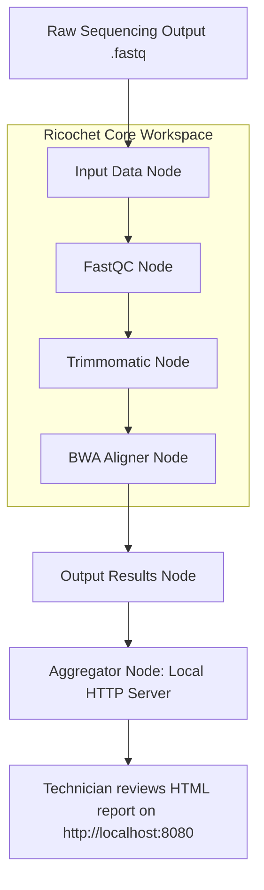

# 🔬 Business & Technical Analysis: Eurofins Genomics, Eurofins IT Solutions, and Ricochet

This document provides a deep-dive research analysis of the operations, revenue streams, and software delivery pipelines of **Eurofins Genomics** and its internal tech partner **Eurofins IT Solutions**, followed by a comparative analysis showing how **Ricochet** (a visual, Docker-powered bioinformatics pipeline builder) can solve their real-world scientific, engineering, and business challenges.

---

## 1. Corporate Profiles: Who They Are & How They Work

### 🧬 Eurofins Genomics
Eurofins Genomics is a global leader in genomic services, functioning as an industrialized, high-throughput business division of the parent company **Eurofins Scientific**. 

#### **A. Core Services & Work Delivery Pipeline**
Eurofins Genomics operates on an industrial scale to process massive biological sample workloads. Their primary offerings include:
1. **Next-Generation Sequencing (NGS):** Whole Genome Sequencing (WGS), Whole Exome Sequencing (WES), RNA-Seq, Amplicon sequencing, and metagenomics.
2. **Sanger Sequencing:** Traditional, rapid DNA sequencing for plasmids, PCR products, and single-reads.
3. **Synthesis:** Custom DNA/RNA oligonucleotide synthesis (oligos) and artificial gene synthesis.
4. **Molecular Biology Services:** Mutagenesis, cloning, plasmid preparation, and genotyping.
5. **Bioinformatics Services:** Secondary and tertiary data analysis, raw data parsing, variant detection, and custom visualization reports.

#### **B. Revenue Model (How They Earn)**
Eurofins Genomics generates revenue through three primary commercial engagements:
* **Fee-for-Service (Standard & Custom Quotes):** Customers pay per sample, per reaction, or per base pair. Standard tasks (like Sanger sequencing or simple oligos) have flat rates, whereas complex NGS projects utilize custom online quoting portals.
* **Full-Time Equivalent (FTE) Contracts:** Large pharmaceutical or academic clients rent dedicated Eurofins scientists and lab resources on long-term retainers to run custom experimental workflows.
* **Professional Scientific Services (PSS) Insourcing:** Eurofins recruits, trains, and manages scientific teams directly inside the client's own facilities to run their laboratory operations.

---

### 💻 Eurofins IT Solutions
Eurofins IT Solutions (such as **Eurofins IT Solutions India - EITSI**) functions as the centralized internal global software delivery organization for the Eurofins Scientific network. 

#### **A. Core Products & Responsibilities**
Rather than acting as a third-party contractor, Eurofins IT Solutions exists **solely to develop and maintain the digital backbone** of Eurofins' 900+ laboratories worldwide. They build:
1. **LIMS (Laboratory Information Management Systems):** Custom software suites that track samples from receipt, log experimental steps, control laboratory instruments, and generate final analytical results.
2. **B2B Portals & E-Commerce:** Global web applications (like *Eurofins Genomics Online Shop*) where clients order oligos, upload sequencing metadata, and download analysis files.
3. **Middleware & Middleware Hubs:** Automation software that handles data ingestion from sequencers (e.g., Illumina, PacBio) and routes them to computational clusters.
4. **Analytical Pipelines:** Automated processing scripts that run QC, alignment, and variant calling on raw laboratory output.

#### **B. Operational Strategy (Hub-and-Spoke)**
Eurofins IT Solutions builds scalable, standardized digital systems at centralized development hubs (the "hub") and deploys them across decentralized, entrepreneur-led local laboratories (the "spokes"). This model requires software that is highly portable, platform-independent, and easy for non-programmers (wet-lab technicians) to operate.

---

## 2. Practical Bioinformatics & IT Challenges

Industrial-scale genomic operations face severe bottleneck challenges:

> [!WARNING]
> **Data Privacy & Compliance (GDPR/HIPAA):** Patient genomic data is highly sensitive. Uploading massive datasets to third-party public clouds often violates strict regional data privacy laws (e.g., HIPAA in the US, GDPR in Europe) or IP agreements with pharma clients.
> 
> **The "Works on My Machine" Setup Nightmare:** Bioinformatics tools are notorious for complex dependencies, specific operating system requirements, and dependency version conflicts. Standardizing command-line tools across different local lab machines (running macOS, Windows, or Linux) is a constant drag on IT support.
> 
> **Redundant Compute & Storage Costs:** NGS data processing takes hours or days. Re-running entire multi-step pipelines when only a single parameter or input file changes wastes huge amounts of server CPU/GPU resources and generates redundant terabytes of output data.
> 
> **Scientific Velocity Bottleneck:** Wet-lab molecular biologists and technicians often lack command-line expertise. When they need to tweak pipeline parameters (e.g., change adapter trimming sequences or adjust quality thresholds), they must wait for a centralized bioinformatician or IT developer to rewrite the scripts.

---

## 3. How Ricochet Solves Eurofins' Challenges

Ricochet maps directly onto the operational requirements of both the laboratory business (Eurofins Genomics) and the software delivery division (Eurofins IT Solutions).

### 🛡️ 1. Complete Data Privacy & Regulatory Compliance (GDPR/HIPAA)
* **The Eurofins Need:** Strict privacy controls for clinical diagnostic testing and pharmaceutical contracts. Cloud processing introduces third-party risk and compliance overhead.
* **The Ricochet Solution:** Ricochet runs **100% locally on the desktop**. It manages local Docker containers to perform high-throughput tasks (like FastQC, STAR, BWA, GATK) directly on local compute resources. Sensitive patient genomic sequences never leave the lab's physically secure premises, simplifying compliance audits.

### 📦 2. Standardized Tool Distribution (Solving the Support Nightmare)
* **The Eurofins Need:** IT Solutions needs to deliver standardized, verified bioinformatics pipelines to lab technicians globally, regardless of whether a local lab runs macOS (Intel or Apple Silicon), Windows (via WSL2), or Linux.
* **The Ricochet Solution:** Ricochet uses **Docker containers as its native building blocks**. It handles platform differences automatically:
  * On Apple Silicon Macs, it configures `--platform linux/amd64` using Rosetta emulation.
  * On Windows, it leverages the WSL2 backend.
  * On Linux, it discovers user-scoped or system sockets automatically and uses `/proc/stat` direct tick delta checks to monitor CPU with zero subprocess overhead.
* **Deployment:** IT Solutions can package stable, regulatory-validated tool versions into custom Docker images, and distribute them to local labs as visual pipelines.

### ⚡ 3. Smart Output Deduplication (Massive Compute & Storage Savings)
* **The Eurofins Need:** High-throughput sequencers generate terabytes of data daily. Processing identical reference genomes or repeating quality-control checks wastes power, time, and storage.
* **The Ricochet Solution:** Ricochet features a **content-addressed workspace**. It runs execution steps in an isolated OS staging area, hashes the output recursively using MD5, and compares it to historical runs.
* If a laboratory technician re-runs a pipeline on unchanged input data, Ricochet **bypasses execution entirely** and reuses the existing results instantly. This slashes internal compute bills and storage pollution.

### 🎨 4. Democratizing Pipeline Tweaking (Wet-Lab Self-Service)
* **The Eurofins Need:** Empowering wet-lab scientists to tweak analysis parameters without overloading core IT or bioinformatics engineering teams.
* **The Ricochet Solution:** A visual, drag-and-drop canvas (reminiscent of Figma or modern visual editors) with a resizable parameter sidebar. Technicians can adjust settings, change Docker image tags (which auto-resolve and pull with layer-by-layer progress tracking), or duplicate nodes to benchmark different configurations side-by-side without writing a single line of bash code.

### 🔄 5. Seamless Hub-and-Spoke Pipeline Portability (Round-Trip Docker Compose)
* **The Eurofins Need:** Centralized IT bioinformaticians design a workflow, but local labs must run it on standalone workstations, or export it to run on an HPC/cloud orchestrator.
* **The Ricochet Solution:** Ricochet's **Docker Compose Export** bundles the visual canvas into a production-ready ZIP containing a `docker-compose.yml` (with correct topological ordering via Kahn's algorithm), environment variable overrides (`pipeline_config.env`), and clean Markdown run documentation.
* **Round-Trip Import:** The exported `.env` file embeds a Base64-encoded `RICOCHET_STATE` metadata payload. Local labs can import this `.env` or `.zip` file straight back into Ricochet, instantly regenerating the visual canvas.

---

## 4. Capability Comparison Matrix

The table below contrasts standard industry approaches (custom Bash/Python scripts, Nextflow/Snakemake, and Galaxy) against Ricochet, specifically from the perspective of an industrial genomics provider like Eurofins.

| Requirement | Command-Line Scripts (Bash/Python) | Nextflow / Snakemake | Galaxy (Web-based Server) | Ricochet (Desktop App) |
| :--- | :--- | :--- | :--- | :--- |
| **User Access** | Developer/Bioinformatician only | Developer/Bioinformatician only | Wet-lab friendly web GUI | **Wet-lab friendly desktop GUI** (Figma-like canvas) |
| **Infrastructure Setup** | Hard; manually manage paths/binaries | Moderate; requires Java, CLI setup, and config files | Hard; requires complex multi-user server administration | **Trivial; single standalone executable** (works out-of-the-box) |
| **Data Privacy** | High (runs locally) | High (runs locally/HPC) | Low (sends files to shared public web servers) | **High (100% local desktop sandbox)** |
| **Pipeline Portability** | Zero (hardcoded paths break constantly) | High (declarative DSL) | High (XML-based tool wraps) | **High (Single-zip Docker Compose export & round-trip import)** |
| **Execution Performance** | Native | Native (parallel execution) | Slow (queue systems, server overhead) | **Native (runs directly via local Docker daemon)** |
| **Environment Consistency** | Low (susceptible to host library rot) | High (containers supported) | High (containers supported) | **High (Docker-native execution by design)** |
| **Compute Deduplication** | None (unless manually coded in Bash) | Basic (caching via file modification times) | None (re-runs from scratch) | **Advanced (Deterministic MD5 directory hashing/caching)** |
| **Live Resource Monitoring** | Manual CLI tools (`top`, `htop`) | Offline reports | Dashboard views | **Live status bar (4s native polling of CPU, GPU, and Disk)** |

---

## 5. Case Study: Eurofins Genomics Workflow Optimization

Let's look at how a typical Eurofins Sanger sequencing plasmid verification workflow would improve using Ricochet:

### **The Walkthrough:**
1. **Intake:** The Sanger sequencing machine exports raw data into a local workspace directory.
2. **Visual Mapping:** A laboratory technician opens the **Sanger Quality Check** template in Ricochet (one of the 5 curated templates).
3. **Execution:** 
   * The **Input Data Node** performs a file-size validation check. If a sequencing file is corrupted (size < 500 bytes), Ricochet flags a warning immediately before spinning up containers.
   * Kahn's algorithm resolves the execution order.
   * If a previous identical run is detected via **MD5 Directory Hashing**, the cached results are instantly loaded, saving server processor cycles.
4. **Tool Execution:** 
   * **FastQC** assesses raw read quality.
   * **Trimmomatic** trims low-quality primer sequences.
   * **BWA** aligns reads to the plasmid reference file.
5. **Reporting:** The final **Aggregator Node** launches a lightweight internal HTTP server inside the container, mapping the results output directory.
6. **Review:** The lab technician clicks the URL inside the log window to open `http://localhost:8080` in their web browser and verify the plasmid mutation map.

---

## 6. Suggested Roadmap for Enterprise Customizations

To integrate Ricochet directly into Eurofins-scale environments, the following future extensions are recommended:

1. **LIMS API Connectors:**
   Create a specialized **LIMS Ingest Node** that queries laboratory information systems via REST APIs using a secure token. This would automatically pull sample metadata and sequence IDs directly into the canvas without requiring manual file picking.
   
2. **Local Registry Authentication:**
   Add support for authenticating with secure, private corporate Docker registries (e.g., Eurofins' private Azure Container Registry or Artifactory) directly inside the sidebar, enabling developers to query internal proprietary bioinformatics tools.

3. **Multi-User Canvas Synch:**
   Allow users to share `.json` workflow diagrams directly to an internal server repository, creating a centralized "Eurofins Template Catalog" accessible inside the app's startup dashboard.
